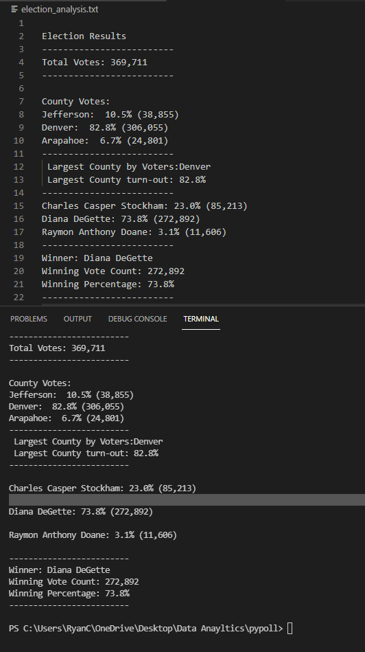

# Election Analysis and Audit 

## Purpose of Electoion Audit
The purpose of this audit was to confirm the winner by majority of these congressional race and to be able to reuse this code on other congretional races elsewhere. It was also to find the voter turnout for the counties that were in the race.

## Election-Audit Results
  + Total Votes cast: 369,711
### County Breakdown
  For Jefferson County: 10.5% (38,855)
  
  For Denver County : 82.8% (306,055)
  
  For Arapahoe County: 6.7% (24,801)

The county with the highest amount of Votes cast was Denver with 82.8% of total votes cast.
### Candidate Breakdwon
  
  For Charles Casper Stockham: 23.0% (85,213)
  
  For Diana DeGette: 73.8% (272,892)
  
  ForRaymon Anthony Doane: 3.1% (11,606)

The winner in this congressional race by majority is Diana DeGette with 73.8% of the total votes.
another verison of the breakdown can be seen here

## Summary and Closing statement
This code is highly reusable as it only requires a few change in the dependances and that the dependances meet the same requirements as the one use in this code. So it can be easily copied into a folder with a diferent CSV file and read that one as it read the previous. For examole, lets say you wanted to audit 20 instead of 3 counties, well the code allows for you do add as many counties as you wish because it doesn't delimit them to only a few. Secondly if your rows in the CSV file are changed, then if you go to where we set the rows values, you can simply change them to the approrite position and the rest of the code will run through it. However the current limit would be that we can only go via majority vote, if another state for example used something more similar to the electoral college than the way we proccess the data will have to change.
  
